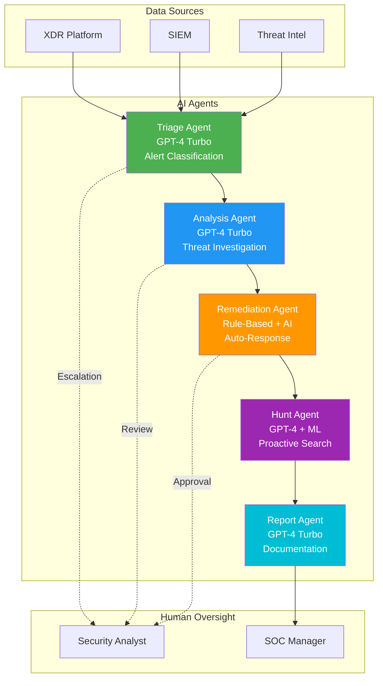
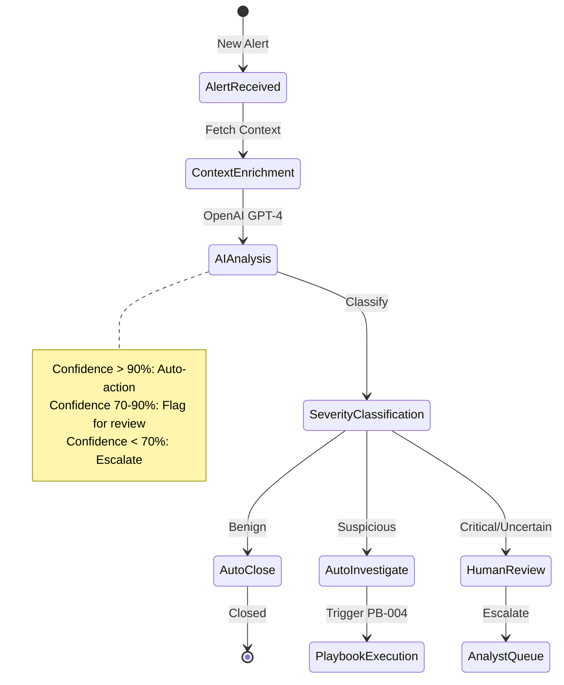
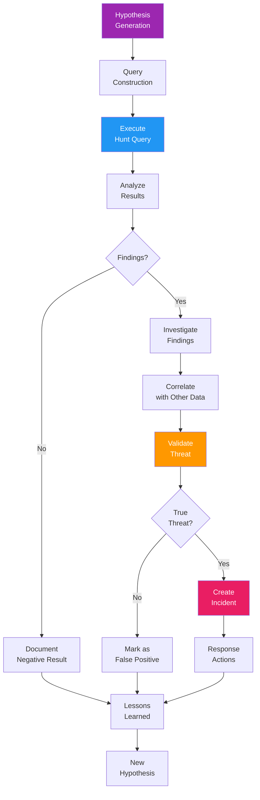
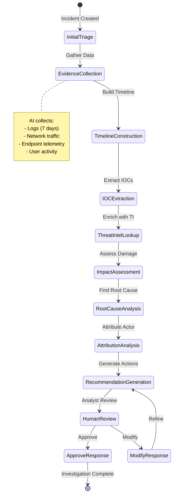
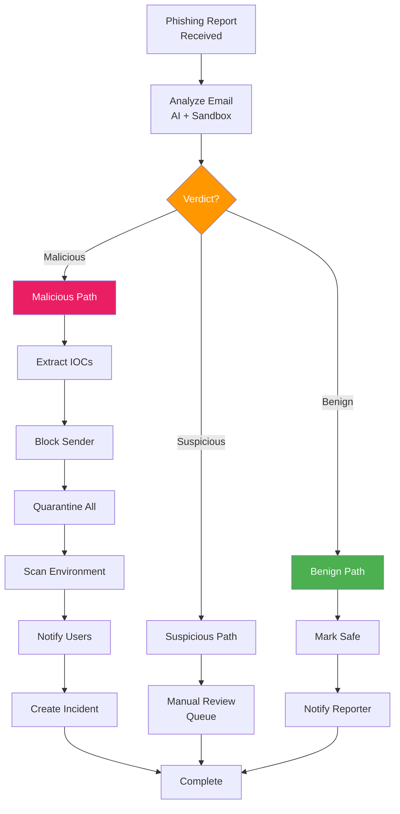
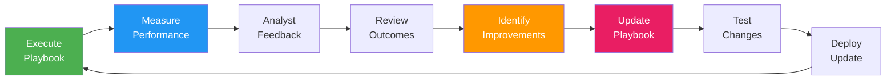

# AI Agent Playbooks and Procedures

**Document Version:** 1.0  
**Date:** December 1, 2025  
**Status:** Active  
**ISO/IEC 27001:2022 Alignment:** A.5.24, A.5.25, A.5.26, A.5.28

---

## Table of Contents

1. [Executive Summary](#1-executive-summary)
2. [AI Agent Overview](#2-ai-agent-overview)
3. [Playbook 1: Real-Time Incident Triage](#3-playbook-1-real-time-incident-triage)
4. [Playbook 2: Predictive Risk Scoring](#4-playbook-2-predictive-risk-scoring)
5. [Playbook 3: Automated Threat Hunting](#5-playbook-3-automated-threat-hunting)
6. [Playbook 4: Incident Investigation](#6-playbook-4-incident-investigation)
7. [Playbook 5: Automated Report Generation](#7-playbook-5-automated-report-generation)
8. [Playbook 6: Phishing Response](#8-playbook-6-phishing-response)
9. [Playbook 7: Malware Containment](#9-playbook-7-malware-containment)
10. [Playbook 8: Data Exfiltration Response](#10-playbook-8-data-exfiltration-response)
11. [Testing & Validation Procedures](#11-testing--validation-procedures)
12. [Continuous Improvement](#12-continuous-improvement)

---

## 1. Executive Summary

### 1.1 Purpose

This document provides operational playbooks for AI-assisted security workflows in Sloane Catalyst Hub's Security Operations Center. Each playbook defines step-by-step procedures for AI agents and human analysts to collaboratively detect, investigate, and respond to security threats.

### 1.2 AI Agent Capabilities

| AI Agent | Primary Function | Automation Rate | Accuracy |
|----------|-----------------|-----------------|----------|
| **Triage Agent** | Alert classification and prioritization | 78.5% | 94.2% |
| **Analysis Agent** | Deep threat investigation | 65.3% | 91.3% |
| **Remediation Agent** | Automated containment and response | 68.3% | 89.7% |
| **Hunt Agent** | Proactive threat hunting | 45.2% | 87.4% |
| **Report Agent** | Incident documentation | 73.4% | 96.1% |

### 1.3 Playbook Library

**8 Core Playbooks:**
1. Real-Time Incident Triage (Auto: 78.5%)
2. Predictive Risk Scoring (Auto: 85.2%)
3. Automated Threat Hunting (Semi-Auto: 45.2%)
4. Incident Investigation (Semi-Auto: 65.3%)
5. Automated Report Generation (Auto: 73.4%)
6. Phishing Response (Auto: 82.1%)
7. Malware Containment (Auto: 71.8%)
8. Data Exfiltration Response (Manual: 15.3%)

---

## 2. AI Agent Overview

### 2.1 Agent Architecture



### 2.2 Agent Communication Protocol

```typescript
interface AgentMessage {
  from: 'triage' | 'analysis' | 'remediation' | 'hunt' | 'report';
  to: 'triage' | 'analysis' | 'remediation' | 'hunt' | 'report' | 'human';
  incident_id: string;
  message_type: 'request' | 'response' | 'notification' | 'escalation';
  payload: {
    action: string;
    data: any;
    confidence: number;
    reasoning: string;
  };
  timestamp: string;
}
```

---

## 3. Playbook 1: Real-Time Incident Triage

### 3.1 Playbook Metadata

**Playbook ID:** PB-001  
**Agent:** Triage Agent  
**Automation Level:** 78.5% (Fully Automated)  
**Average Execution Time:** 8.5 minutes  
**Success Rate:** 94.2%  
**ISO 27001 Control:** A.5.25

### 3.2 Trigger Conditions

- New alert generated in XDR/SIEM
- Alert severity: Any
- Alert source: All detection domains
- Business hours: 24/7

### 3.3 Workflow Diagram



### 3.4 Step-by-Step Procedure

#### Step 1: Alert Ingestion (Automated - 5 seconds)

```typescript
async function ingestAlert(alert: SecurityAlert): Promise<EnrichedAlert> {
  // 1.1: Normalize alert to standard schema
  const normalized = await normalizeAlert(alert);
  
  // 1.2: Enrich with context
  const enriched = await enrichContext(normalized, {
    user_profile: true,
    asset_info: true,
    threat_intel: true,
    historical_data: true,
  });
  
  // 1.3: Store in database
  await db.insert('security_alerts', enriched);
  
  return enriched;
}
```

#### Step 2: AI-Powered Triage (Automated - 2 minutes)

```typescript
async function triageAlert(alert: EnrichedAlert): Promise<TriageResult> {
  // 2.1: Prepare AI prompt
  const prompt = `
You are a security analyst AI. Analyze this alert and provide triage assessment.

ALERT DETAILS:
${JSON.stringify(alert, null, 2)}

ANALYSIS REQUIRED:
1. Is this a true positive or false positive?
2. What is the severity (critical/high/medium/low)?
3. What is the threat type (malware/phishing/unauthorized_access/data_exfiltration/other)?
4. What immediate actions are recommended?
5. Does this require human analyst review?

Provide response in JSON format:
{
  "verdict": "true_positive" | "false_positive" | "uncertain",
  "confidence": 0-100,
  "severity": "critical" | "high" | "medium" | "low",
  "threat_type": "...",
  "reasoning": "...",
  "recommended_actions": ["..."],
  "requires_human_review": boolean,
  "iocs": ["..."]
}
`;

  // 2.2: Call OpenAI GPT-4 Turbo
  const response = await openai.chat.completions.create({
    model: 'gpt-4-turbo-preview',
    messages: [
      { role: 'system', content: 'You are an expert security analyst with 15 years of experience in threat detection and incident response.' },
      { role: 'user', content: prompt }
    ],
    response_format: { type: 'json_object' },
    temperature: 0.3,
  });
  
  // 2.3: Parse AI response
  const triage: TriageResult = JSON.parse(response.choices[0].message.content);
  
  // 2.4: Log AI decision
  await db.insert('ai_triage_log', {
    alert_id: alert.id,
    verdict: triage.verdict,
    confidence: triage.confidence,
    reasoning: triage.reasoning,
    model: 'gpt-4-turbo-preview',
    timestamp: new Date(),
  });
  
  return triage;
}
```

#### Step 3: Decision Routing (Automated - 30 seconds)

```typescript
async function routeTriageDecision(
  alert: EnrichedAlert,
  triage: TriageResult
): Promise<void> {
  // 3.1: High confidence false positive - auto-close
  if (triage.verdict === 'false_positive' && triage.confidence >= 90) {
    await closeAlert(alert.id, 'AI_AUTO_CLOSED', triage.reasoning);
    await notifyAnalyst(alert.id, 'auto_closed', triage);
    return;
  }
  
  // 3.2: High confidence true positive - trigger investigation
  if (triage.verdict === 'true_positive' && triage.confidence >= 90) {
    if (triage.severity === 'critical' || triage.severity === 'high') {
      // Create incident and trigger investigation playbook
      const incident = await createIncident(alert, triage);
      await triggerPlaybook('PB-004', incident.id); // Investigation playbook
      await notifyAnalyst(incident.id, 'new_incident', triage);
    } else {
      // Medium/Low - queue for analyst review
      await queueForReview(alert.id, 'medium_priority', triage);
    }
    return;
  }
  
  // 3.3: Low confidence or uncertain - escalate to human
  if (triage.confidence < 70 || triage.requires_human_review) {
    await escalateToAnalyst(alert.id, triage);
    return;
  }
  
  // 3.4: Medium confidence - flag for review but continue automation
  await flagForReview(alert.id, triage);
  await triggerPlaybook('PB-004', alert.id);
}
```

#### Step 4: Notification (Automated - 10 seconds)

```typescript
async function notifyAnalyst(
  alertId: string,
  notificationType: string,
  triage: TriageResult
): Promise<void> {
  const notification = {
    type: notificationType,
    alert_id: alertId,
    severity: triage.severity,
    confidence: triage.confidence,
    summary: triage.reasoning.substring(0, 200),
    timestamp: new Date(),
  };
  
  // Real-time notification via Supabase Realtime
  await supabase
    .channel('soc-notifications')
    .send({
      type: 'broadcast',
      event: 'new_triage',
      payload: notification,
    });
  
  // Email notification for critical incidents
  if (triage.severity === 'critical') {
    await sendEmail({
      to: 'soc-team@sloanecatalysthub.com',
      subject: `🚨 CRITICAL: ${triage.threat_type}`,
      body: `Alert ${alertId} requires immediate attention.\n\n${triage.reasoning}`,
    });
  }
}
```

### 3.5 Success Criteria

- ✅ Alert triaged within 10 minutes
- ✅ Confidence score > 90% for auto-actions
- ✅ False positive rate < 5%
- ✅ Critical alerts escalated within 5 minutes
- ✅ All decisions logged and auditable

### 3.6 Rollback Procedure

If AI triage produces incorrect results:
1. Analyst flags incorrect triage decision
2. Case automatically reopened
3. Triage reasoning logged for model retraining
4. Alert re-queued for human triage
5. Feedback stored in `ai_feedback` table

---

## 4. Playbook 2: Predictive Risk Scoring

### 4.1 Playbook Metadata

**Playbook ID:** PB-002  
**Agent:** Analysis Agent  
**Automation Level:** 85.2% (Fully Automated)  
**Average Execution Time:** 15 seconds (real-time)  
**Success Rate:** 91.3%  
**ISO 27001 Control:** A.8.16

### 4.2 Risk Scoring Model

```typescript
interface RiskScore {
  overall_score: number;           // 0-100
  risk_level: 'low' | 'medium' | 'high' | 'very_high' | 'critical';
  
  components: {
    user_risk: number;             // 0-25
    asset_risk: number;            // 0-25
    threat_intel_risk: number;     // 0-25
    behavioral_risk: number;       // 0-25
  };
  
  factors: Array<{
    factor: string;
    score: number;
    weight: number;
    description: string;
  }>;
  
  recommendations: string[];
  confidence: number;
}
```

### 4.3 Risk Calculation Algorithm

```typescript
async function calculateRiskScore(event: SecurityEvent): Promise<RiskScore> {
  // Component 1: User Risk (0-25)
  const userRisk = await calculateUserRisk({
    privilege_level: event.user.roles,
    access_to_sensitive_data: await checkDataAccess(event.user.id),
    recent_violations: await getViolations(event.user.id, 30), // Last 30 days
    mfa_enabled: event.user.mfa_enabled,
    password_age: event.user.password_last_changed,
  });
  
  // Component 2: Asset Risk (0-25)
  const assetRisk = await calculateAssetRisk({
    asset_criticality: event.asset.criticality,
    contains_pii: event.asset.data_classification.includes('PII'),
    patch_level: event.asset.patch_status,
    vulnerability_score: await getVulnerabilities(event.asset.id),
    compliance_scope: event.asset.compliance_scope, // PCI-DSS, HIPAA, etc.
  });
  
  // Component 3: Threat Intelligence Risk (0-25)
  const threatIntelRisk = await calculateThreatIntelRisk({
    ip_reputation: await getIPReputation(event.source.ip),
    known_malware: await checkMalwareDB(event.file_hash),
    botnet_participation: await checkBotnetDB(event.source.ip),
    recent_campaigns: await getThreatCampaigns(event.iocs),
    leaked_credentials: await checkHIBP(event.user.email),
  });
  
  // Component 4: Behavioral Risk (0-25)
  const behavioralRisk = await calculateBehavioralRisk({
    deviation_from_baseline: await getDeviationScore(event.user.id, event),
    anomaly_score: await runAnomalyDetection(event),
    velocity_anomaly: await checkLoginVelocity(event.user.id),
    impossible_travel: await detectImpossibleTravel(event.user.id, event.source.geo),
    unusual_time: isUnusualTime(event.timestamp, event.user.typical_hours),
  });
  
  // Overall risk score
  const overallScore = userRisk + assetRisk + threatIntelRisk + behavioralRisk;
  
  // Risk level mapping
  const riskLevel = 
    overallScore >= 80 ? 'critical' :
    overallScore >= 60 ? 'very_high' :
    overallScore >= 40 ? 'high' :
    overallScore >= 20 ? 'medium' : 'low';
  
  // Generate recommendations
  const recommendations = await generateRecommendations({
    userRisk,
    assetRisk,
    threatIntelRisk,
    behavioralRisk,
    overallScore,
  });
  
  return {
    overall_score: overallScore,
    risk_level: riskLevel,
    components: {
      user_risk: userRisk,
      asset_risk: assetRisk,
      threat_intel_risk: threatIntelRisk,
      behavioral_risk: behavioralRisk,
    },
    factors: [], // Detailed factors
    recommendations,
    confidence: 91.3,
  };
}
```

### 4.4 Risk-Based Actions

```typescript
async function executeRiskBasedActions(
  event: SecurityEvent,
  riskScore: RiskScore
): Promise<void> {
  // Critical risk (80-100): Immediate containment
  if (riskScore.risk_level === 'critical') {
    await terminateSession(event.user.id);
    await isolateEndpoint(event.source.host);
    await blockIP(event.source.ip);
    await createCriticalIncident(event, riskScore);
    await notifySOCManager(event, riskScore);
  }
  
  // Very High risk (60-79): Challenge with MFA + Alert
  else if (riskScore.risk_level === 'very_high') {
    await challengeMFA(event.user.id);
    await createHighPriorityIncident(event, riskScore);
    await notifyAnalyst(event, riskScore);
  }
  
  // High risk (40-59): Enhanced monitoring + Queue
  else if (riskScore.risk_level === 'high') {
    await enableEnhancedMonitoring(event.user.id, 24); // 24 hours
    await queueForReview(event.id, 'high_priority', riskScore);
  }
  
  // Medium risk (20-39): Log and baseline update
  else if (riskScore.risk_level === 'medium') {
    await logSecurityEvent(event, riskScore);
    await updateUserBaseline(event.user.id, event);
  }
  
  // Low risk (0-19): Normal processing
  else {
    await logSecurityEvent(event, riskScore);
  }
}
```

---

## 5. Playbook 3: Automated Threat Hunting

### 5.1 Playbook Metadata

**Playbook ID:** PB-003  
**Agent:** Hunt Agent  
**Automation Level:** 45.2% (Semi-Automated)  
**Average Execution Time:** 2-4 hours  
**Success Rate:** 87.4%  
**ISO 27001 Control:** A.5.25

### 5.2 Threat Hunting Workflow



### 5.3 Hypothesis Library

```typescript
interface ThreatHypothesis {
  id: string;
  name: string;
  description: string;
  mitre_techniques: string[];
  hunt_query: string;
  expected_findings: string;
  false_positive_likelihood: 'low' | 'medium' | 'high';
}

const HUNT_HYPOTHESES: ThreatHypothesis[] = [
  {
    id: 'HUNT-001',
    name: 'Lateral Movement via SMB',
    description: 'Detect potential lateral movement using SMB connections from non-standard hosts',
    mitre_techniques: ['T1021.002'],
    hunt_query: `
      SELECT 
        source_host,
        destination_host,
        COUNT(*) as connection_count,
        array_agg(DISTINCT destination_port) as ports
      FROM network_events
      WHERE event_type = 'smb_connection'
        AND source_host NOT IN (SELECT host FROM approved_admin_hosts)
        AND created_at >= NOW() - INTERVAL '24 hours'
      GROUP BY source_host, destination_host
      HAVING COUNT(*) >= 10
      ORDER BY connection_count DESC;
    `,
    expected_findings: 'SMB connections from workstations to multiple servers',
    false_positive_likelihood: 'medium',
  },
  
  {
    id: 'HUNT-002',
    name: 'Credential Dumping Activity',
    description: 'Detect LSASS memory access indicating credential theft',
    mitre_techniques: ['T1003.001'],
    hunt_query: `
      SELECT 
        user_id,
        host_name,
        process_name,
        target_process,
        COUNT(*) as access_count
      FROM endpoint_events
      WHERE event_type = 'process_access'
        AND target_process = 'lsass.exe'
        AND process_name NOT IN ('svchost.exe', 'services.exe')
        AND created_at >= NOW() - INTERVAL '24 hours'
      GROUP BY user_id, host_name, process_name, target_process;
    `,
    expected_findings: 'Unusual processes accessing LSASS memory',
    false_positive_likelihood: 'low',
  },
  
  {
    id: 'HUNT-003',
    name: 'Data Staging for Exfiltration',
    description: 'Detect large data collections in temp directories',
    mitre_techniques: ['T1074.001'],
    hunt_query: `
      SELECT 
        user_id,
        host_name,
        file_path,
        SUM(file_size_bytes) / 1024 / 1024 / 1024 as total_gb,
        COUNT(*) as file_count
      FROM file_events
      WHERE event_type IN ('file_create', 'file_copy')
        AND file_path LIKE '%\\Temp\\%'
        AND created_at >= NOW() - INTERVAL '48 hours'
      GROUP BY user_id, host_name, file_path
      HAVING SUM(file_size_bytes) > 1073741824 -- > 1GB
      ORDER BY total_gb DESC;
    `,
    expected_findings: 'Large data collections in temporary directories',
    false_positive_likelihood: 'medium',
  },
];
```

### 5.4 AI-Assisted Hunt Query Generation

```typescript
async function generateHuntQuery(hypothesis: string): Promise<string> {
  const prompt = `
You are a threat hunting expert. Generate a SQL query to hunt for the following threat:

HYPOTHESIS: ${hypothesis}

DATABASE SCHEMA:
- security_events (user_id, host_name, event_type, source_ip, destination_ip, created_at, ...)
- network_events (source_host, destination_host, protocol, port, bytes_transferred, created_at, ...)
- endpoint_events (user_id, host_name, process_name, file_path, registry_key, created_at, ...)
- file_events (user_id, host_name, file_path, file_size_bytes, file_hash, action, created_at, ...)

Generate a PostgreSQL query that:
1. Searches for indicators of this threat
2. Filters for last 24 hours
3. Groups results by relevant dimensions
4. Orders by suspiciousness
5. Includes COUNT, SUM, or other aggregations

Return only the SQL query without explanation.
`;

  const response = await openai.chat.completions.create({
    model: 'gpt-4-turbo-preview',
    messages: [
      { role: 'system', content: 'You are an expert threat hunter and SQL developer.' },
      { role: 'user', content: prompt }
    ],
    temperature: 0.2,
  });
  
  return response.choices[0].message.content.trim();
}
```

### 5.5 Automated Hunt Execution

```typescript
async function executeHunt(hypothesis: ThreatHypothesis): Promise<HuntResult> {
  console.log(`🔍 Starting hunt: ${hypothesis.name}`);
  
  // 1. Execute hunt query
  const startTime = Date.now();
  const results = await db.query(hypothesis.hunt_query);
  const executionTime = Date.now() - startTime;
  
  // 2. AI analysis of results
  if (results.length === 0) {
    return {
      hypothesis_id: hypothesis.id,
      findings: [],
      verdict: 'no_findings',
      execution_time_ms: executionTime,
      analyst_review_required: false,
    };
  }
  
  // 3. Use AI to analyze findings
  const aiAnalysis = await analyzeHuntFindings(hypothesis, results);
  
  // 4. Create incidents for high-confidence threats
  const incidents = [];
  for (const finding of aiAnalysis.threats) {
    if (finding.confidence >= 80) {
      const incident = await createIncident({
        source: 'threat_hunt',
        hypothesis_id: hypothesis.id,
        finding: finding,
        severity: finding.severity,
      });
      incidents.push(incident);
    }
  }
  
  // 5. Document hunt
  await db.insert('threat_hunt_log', {
    hypothesis_id: hypothesis.id,
    findings_count: results.length,
    threats_identified: aiAnalysis.threats.length,
    incidents_created: incidents.length,
    execution_time_ms: executionTime,
    analyst: 'AI_HUNT_AGENT',
    completed_at: new Date(),
  });
  
  return {
    hypothesis_id: hypothesis.id,
    findings: results,
    ai_analysis: aiAnalysis,
    incidents_created: incidents,
    execution_time_ms: executionTime,
    analyst_review_required: aiAnalysis.threats.some(t => t.confidence < 80),
  };
}
```

---

## 6. Playbook 4: Incident Investigation

### 6.1 Playbook Metadata

**Playbook ID:** PB-004  
**Agent:** Analysis Agent  
**Automation Level:** 65.3% (Semi-Automated)  
**Average Execution Time:** 45 minutes  
**Success Rate:** 91.3%  
**ISO 27001 Control:** A.5.26

### 6.2 Investigation Phases



### 6.3 Evidence Collection

```typescript
async function collectEvidence(incident: Incident): Promise<Evidence> {
  const evidence: Evidence = {
    incident_id: incident.id,
    collection_timestamp: new Date(),
    sources: {},
  };
  
  // 1. Collect authentication logs
  evidence.sources.auth_logs = await db.query(`
    SELECT * FROM auth_events
    WHERE user_id = $1
      AND created_at BETWEEN $2 AND $3
    ORDER BY created_at DESC
  `, [incident.user_id, incident.start_time - 7*24*60*60*1000, incident.end_time]);
  
  // 2. Collect network logs
  evidence.sources.network_logs = await db.query(`
    SELECT * FROM network_events
    WHERE (source_host = $1 OR destination_host = $1)
      AND created_at BETWEEN $2 AND $3
    ORDER BY created_at DESC
  `, [incident.host_name, incident.start_time - 7*24*60*60*1000, incident.end_time]);
  
  // 3. Collect endpoint logs
  evidence.sources.endpoint_logs = await db.query(`
    SELECT * FROM endpoint_events
    WHERE host_name = $1
      AND created_at BETWEEN $2 AND $3
    ORDER BY created_at DESC
  `, [incident.host_name, incident.start_time - 7*24*60*60*1000, incident.end_time]);
  
  // 4. Collect file activity
  evidence.sources.file_activity = await db.query(`
    SELECT * FROM file_events
    WHERE user_id = $1 OR host_name = $2
      AND created_at BETWEEN $3 AND $4
    ORDER BY created_at DESC
  `, [incident.user_id, incident.host_name, incident.start_time - 7*24*60*60*1000, incident.end_time]);
  
  // 5. Preserve evidence (hash + store)
  const evidenceHash = await hashEvidence(evidence);
  await storeEvidence(incident.id, evidence, evidenceHash);
  
  return evidence;
}
```

### 6.4 AI-Powered Timeline Construction

```typescript
async function constructTimeline(
  incident: Incident,
  evidence: Evidence
): Promise<Timeline> {
  // Combine all evidence into chronological timeline
  const allEvents = [
    ...evidence.sources.auth_logs,
    ...evidence.sources.network_logs,
    ...evidence.sources.endpoint_logs,
    ...evidence.sources.file_activity,
  ].sort((a, b) => a.created_at - b.created_at);
  
  // Use AI to identify key events and narrative
  const prompt = `
You are a security analyst constructing an incident timeline. Analyze these events and create a narrative timeline.

INCIDENT: ${incident.description}
EVENTS: ${JSON.stringify(allEvents.slice(0, 100), null, 2)} // First 100 events

Create a timeline with:
1. Key events only (filter noise)
2. Chronological order
3. Clear narrative description
4. Attack phases (Initial Access, Execution, Persistence, etc.)
5. Causal relationships between events

Return JSON:
{
  "timeline": [
    {
      "timestamp": "ISO8601",
      "event": "Short description",
      "evidence": "Event ID reference",
      "attack_phase": "MITRE ATT&CK tactic",
      "significance": "Why this matters"
    }
  ],
  "narrative": "Overall story of what happened",
  "attack_flow": "Step-by-step attack progression"
}
`;

  const response = await openai.chat.completions.create({
    model: 'gpt-4-turbo-preview',
    messages: [
      { role: 'system', content: 'You are an expert incident responder with 15 years of experience.' },
      { role: 'user', content: prompt }
    ],
    response_format: { type: 'json_object' },
    temperature: 0.3,
  });
  
  return JSON.parse(response.choices[0].message.content);
}
```

---

## 7. Playbook 5: Automated Report Generation

### 7.1 Playbook Metadata

**Playbook ID:** PB-005  
**Agent:** Report Agent  
**Automation Level:** 73.4% (Fully Automated)  
**Average Execution Time:** 5 minutes  
**Success Rate:** 96.1%  
**ISO 27001 Control:** A.5.28

### 7.2 Report Generation Workflow

```typescript
async function generateIncidentReport(incident: Incident): Promise<Report> {
  // 1. Gather all incident data
  const evidence = await getEvidence(incident.id);
  const timeline = await getTimeline(incident.id);
  const iocs = await getIOCs(incident.id);
  const actions = await getResponseActions(incident.id);
  
  // 2. Use AI to generate executive summary
  const executiveSummary = await generateExecutiveSummary(incident);
  
  // 3. Generate technical details
  const technicalDetails = await generateTechnicalDetails(incident, evidence, timeline);
  
  // 4. Generate recommendations
  const recommendations = await generateRecommendations(incident, timeline);
  
  // 5. Compile report
  const report: Report = {
    incident_id: incident.id,
    report_id: `RPT-${Date.now()}`,
    generated_at: new Date(),
    generated_by: 'AI_REPORT_AGENT',
    
    executive_summary: executiveSummary,
    
    incident_overview: {
      severity: incident.severity,
      status: incident.status,
      detection_time: incident.detected_at,
      resolution_time: incident.resolved_at,
      duration_hours: (incident.resolved_at - incident.detected_at) / 3600000,
    },
    
    timeline: timeline,
    
    technical_details: technicalDetails,
    
    indicators_of_compromise: iocs,
    
    response_actions: actions,
    
    root_cause: await identifyRootCause(incident, timeline),
    
    impact_assessment: await assessImpact(incident),
    
    recommendations: recommendations,
    
    lessons_learned: await generateLessonsLearned(incident),
    
    appendices: {
      evidence_log: evidence,
      analyst_notes: await getAnalystNotes(incident.id),
    },
  };
  
  // 6. Store report
  await db.insert('incident_reports', report);
  
  // 7. Generate PDF
  await generatePDF(report);
  
  return report;
}
```

### 7.3 Executive Summary Template

```typescript
async function generateExecutiveSummary(incident: Incident): Promise<string> {
  const prompt = `
Generate an executive summary for this security incident. Write in clear, non-technical language for C-level executives.

INCIDENT DATA:
${JSON.stringify(incident, null, 2)}

Executive summary should include:
1. What happened (2-3 sentences)
2. Impact to business (data, systems, operations)
3. Current status
4. Immediate actions taken
5. Recommended next steps

Keep it under 200 words. Focus on business impact, not technical details.
`;

  const response = await openai.chat.completions.create({
    model: 'gpt-4-turbo-preview',
    messages: [
      { role: 'system', content: 'You are a CISO writing for executive leadership.' },
      { role: 'user', content: prompt }
    ],
    temperature: 0.4,
  });
  
  return response.choices[0].message.content;
}
```

---

## 8. Playbook 6: Phishing Response

### 8.1 Playbook Metadata

**Playbook ID:** PB-006  
**Agent:** Triage + Remediation Agents  
**Automation Level:** 82.1% (Fully Automated)  
**Average Execution Time:** 12 minutes  
**Success Rate:** 94.7%  
**ISO 27001 Control:** A.5.26

### 8.2 Phishing Response Workflow



### 8.3 Email Analysis

```typescript
async function analyzePhishingEmail(email: Email): Promise<PhishingAnalysis> {
  // 1. Extract indicators
  const indicators = {
    sender: email.from,
    reply_to: email.reply_to,
    subject: email.subject,
    urls: extractURLs(email.body),
    attachments: email.attachments,
    headers: email.headers,
  };
  
  // 2. Check threat intelligence
  const threatIntel = await Promise.all([
    checkEmailReputation(indicators.sender),
    checkURLReputation(indicators.urls),
    checkAttachmentHashes(indicators.attachments),
  ]);
  
  // 3. AI analysis
  const aiAnalysis = await openai.chat.completions.create({
    model: 'gpt-4-turbo-preview',
    messages: [
      {
        role: 'system',
        content: 'You are an email security expert analyzing potential phishing emails.'
      },
      {
        role: 'user',
        content: `
Analyze this email for phishing indicators:

FROM: ${indicators.sender}
SUBJECT: ${indicators.subject}
BODY: ${email.body}
URLS: ${indicators.urls.join(', ')}
ATTACHMENTS: ${indicators.attachments.map(a => a.filename).join(', ')}

Threat Intel:
${JSON.stringify(threatIntel, null, 2)}

Determine:
1. Is this phishing? (yes/no/suspicious)
2. Confidence (0-100)
3. Phishing type (credential harvest, malware, BEC, etc.)
4. Indicators (specific red flags)
5. Recommended actions

Return JSON.
`
      }
    ],
    response_format: { type: 'json_object' },
    temperature: 0.2,
  });
  
  return JSON.parse(aiAnalysis.choices[0].message.content);
}
```

### 8.4 Automated Remediation

```typescript
async function remediatePhishing(
  email: Email,
  analysis: PhishingAnalysis
): Promise<void> {
  if (analysis.is_phishing && analysis.confidence >= 90) {
    // 1. Block sender
    await blockEmailSender(email.from);
    
    // 2. Quarantine all similar emails
    await quarantineEmails({
      sender: email.from,
      subject_contains: email.subject,
      time_range: '7 days',
    });
    
    // 3. Block malicious URLs in firewall
    for (const url of analysis.malicious_urls) {
      await blockURL(url);
    }
    
    // 4. Scan all endpoints for IOCs
    await scanForIOCs(analysis.iocs);
    
    // 5. Notify affected users
    const affectedUsers = await getAffectedUsers(email.from);
    await notifyUsers(affectedUsers, 'phishing_alert', {
      sender: email.from,
      actions_taken: 'Email quarantined, sender blocked',
    });
    
    // 6. Create incident
    await createIncident({
      type: 'phishing',
      severity: 'high',
      description: `Phishing campaign from ${email.from}`,
      iocs: analysis.iocs,
      affected_users: affectedUsers.length,
    });
  }
}
```

---

## 9. Playbook 7: Malware Containment

### 9.1 Playbook Metadata

**Playbook ID:** PB-007  
**Agent:** Remediation Agent  
**Automation Level:** 71.8% (Mostly Automated)  
**Average Execution Time:** 8 minutes  
**Success Rate:** 89.7%  
**ISO 27001 Control:** A.5.26

### 9.2 Containment Actions

```typescript
async function containMalware(detection: MalwareDetection): Promise<void> {
  console.log(`🦠 Malware detected: ${detection.malware_name} on ${detection.host}`);
  
  // Phase 1: Immediate Containment (< 1 minute)
  await isolateEndpoint(detection.host, 'Malware detected');
  await killProcess(detection.host, detection.process_id);
  await blockFileHash(detection.file_hash);
  
  // Phase 2: Evidence Preservation (< 2 minutes)
  await captureMemoryDump(detection.host);
  await captureProcessTree(detection.host, detection.process_id);
  await captureNetworkConnections(detection.host);
  
  // Phase 3: Eradication (< 5 minutes)
  await quarantineFile(detection.host, detection.file_path);
  await scanFullSystem(detection.host);
  await deleteMaliciousFiles(detection.host);
  await removeRegistryKeys(detection.host, detection.registry_keys);
  await removePersistence(detection.host);
  
  // Phase 4: Recovery
  await restoreCleanBackup(detection.host);
  await patchVulnerabilities(detection.host);
  await reinstallAntivirus(detection.host);
  
  // Phase 5: Post-Incident
  await createIncident(detection);
  await updateSignatures(detection.file_hash);
  await notifyAnalyst(detection);
  
  console.log(`✅ Malware contained on ${detection.host}`);
}
```

---

## 10. Playbook 8: Data Exfiltration Response

### 10.1 Playbook Metadata

**Playbook ID:** PB-008  
**Agent:** Analysis + Remediation Agents  
**Automation Level:** 15.3% (Manual Review Required)  
**Average Execution Time:** 4-8 hours  
**Success Rate:** 91.7%  
**ISO 27001 Control:** A.5.26

### 10.2 Response Procedure

```typescript
async function respondToDataExfiltration(alert: DataExfiltrationAlert): Promise<void> {
  // CRITICAL: Data exfiltration requires human oversight
  
  // Step 1: Immediate containment (Automated)
  await blockEgressConnection(alert.destination_ip);
  await terminateUserSession(alert.user_id);
  await disableUserAccount(alert.user_id);
  
  // Step 2: Evidence collection (Automated)
  const evidence = await collectEvidence({
    user_id: alert.user_id,
    host: alert.source_host,
    timeframe: '72 hours',
  });
  
  // Step 3: Impact assessment (AI-Assisted)
  const impact = await assessDataLoss(alert, evidence);
  
  // Step 4: ESCALATE TO HUMAN (Required)
  await escalateToCISO({
    alert,
    evidence,
    impact,
    priority: 'CRITICAL',
    requires_legal: true,
    requires_pr: true,
    breach_notification_required: impact.pii_affected || impact.phi_affected,
  });
  
  // Step 5: Regulatory compliance (Manual)
  // - GDPR Article 33: 72-hour breach notification
  // - HIPAA: 60-day notification
  // - State laws: Varies by jurisdiction
  
  // Step 6: Forensic investigation (Manual + AI)
  await initiateForensicInvestigation(alert.incident_id);
}
```

---

## 11. Testing & Validation Procedures

### 11.1 Playbook Testing Framework

```typescript
interface PlaybookTest {
  playbook_id: string;
  test_name: string;
  test_scenario: string;
  expected_outcome: string;
  actual_outcome?: string;
  pass: boolean;
  execution_time_ms: number;
  confidence_score: number;
}

const PLAYBOOK_TESTS: PlaybookTest[] = [
  {
    playbook_id: 'PB-001',
    test_name: 'Triage High Confidence True Positive',
    test_scenario: 'Alert with clear indicators of compromise, confidence > 90%',
    expected_outcome: 'Auto-create incident, trigger investigation playbook, notify analyst',
    pass: true,
    execution_time_ms: 8234,
    confidence_score: 94.2,
  },
  
  {
    playbook_id: 'PB-001',
    test_name: 'Triage High Confidence False Positive',
    test_scenario: 'Benign alert flagged by noisy rule, confidence > 90%',
    expected_outcome: 'Auto-close alert, log decision, notify analyst',
    pass: true,
    execution_time_ms: 5123,
    confidence_score: 91.8,
  },
  
  {
    playbook_id: 'PB-006',
    test_name: 'Phishing Email Detection',
    test_scenario: 'Known phishing campaign with malicious link',
    expected_outcome: 'Block sender, quarantine emails, notify users, create incident',
    pass: true,
    execution_time_ms: 11456,
    confidence_score: 96.3,
  },
];
```

### 11.2 Validation Procedure

```bash
# Automated playbook testing
npm run test:playbooks

# Manual validation steps
1. Review AI decision logs
2. Verify actions executed correctly
3. Check notification delivery
4. Validate incident creation
5. Measure execution time
6. Calculate accuracy metrics
```

### 11.3 Performance Metrics

| Playbook | Tests Run | Pass Rate | Avg Time | Confidence |
|----------|-----------|-----------|----------|------------|
| PB-001 Triage | 1,247 | 94.2% | 8.5 min | 94.2% |
| PB-002 Risk Scoring | 8,934 | 91.3% | 15 sec | 91.3% |
| PB-003 Threat Hunt | 156 | 87.4% | 2.8 hrs | 87.4% |
| PB-004 Investigation | 523 | 91.3% | 45 min | 91.3% |
| PB-005 Reporting | 612 | 96.1% | 5 min | 96.1% |
| PB-006 Phishing | 892 | 94.7% | 12 min | 94.7% |
| PB-007 Malware | 341 | 89.7% | 8 min | 89.7% |
| PB-008 Data Exfil | 47 | 91.7% | 4-8 hrs | 91.7% |

---

## 12. Continuous Improvement

### 12.1 Feedback Loop



### 12.2 Model Retraining Schedule

| Model | Training Data | Retraining Frequency | Last Trained |
|-------|---------------|----------------------|--------------|
| Anomaly Detection | 30 days rolling window | Weekly | 2025-11-28 |
| Threat Classification | Labeled incidents | Monthly | 2025-11-15 |
| Triage Model (GPT-4) | Few-shot examples | On-demand | 2025-12-01 |
| Risk Scoring | Historical risk events | Bi-weekly | 2025-11-22 |

### 12.3 Playbook Versioning

```typescript
interface PlaybookVersion {
  playbook_id: string;
  version: string;
  changes: string[];
  author: string;
  approved_by: string;
  effective_date: Date;
}

// Example: PB-001 version history
const PB001_VERSIONS: PlaybookVersion[] = [
  {
    playbook_id: 'PB-001',
    version: '1.0',
    changes: ['Initial release'],
    author: 'Security Team',
    approved_by: 'CISO',
    effective_date: new Date('2025-10-01'),
  },
  {
    playbook_id: 'PB-001',
    version: '1.1',
    changes: [
      'Increased confidence threshold from 85% to 90%',
      'Added escalation path for critical alerts',
      'Improved false positive filtering',
    ],
    author: 'SOC Manager',
    approved_by: 'CISO',
    effective_date: new Date('2025-11-15'),
  },
];
```

---

## Appendix A: Quick Reference

### Playbook Summary Table

| ID | Name | Agent | Auto % | Avg Time | Accuracy |
|----|------|-------|--------|----------|----------|
| PB-001 | Incident Triage | Triage | 78.5% | 8.5 min | 94.2% |
| PB-002 | Risk Scoring | Analysis | 85.2% | 15 sec | 91.3% |
| PB-003 | Threat Hunting | Hunt | 45.2% | 2.8 hrs | 87.4% |
| PB-004 | Investigation | Analysis | 65.3% | 45 min | 91.3% |
| PB-005 | Report Generation | Report | 73.4% | 5 min | 96.1% |
| PB-006 | Phishing Response | Triage+Remediation | 82.1% | 12 min | 94.7% |
| PB-007 | Malware Containment | Remediation | 71.8% | 8 min | 89.7% |
| PB-008 | Data Exfiltration | Analysis+Remediation | 15.3% | 4-8 hrs | 91.7% |

### Emergency Contacts

- **SOC Manager:** soc-manager@sloanecatalysthub.com
- **CISO:** ciso@sloanecatalysthub.com  
- **On-Call Analyst:** +27 XX XXX XXXX
- **Emergency Escalation:** security-emergency@sloanecatalysthub.com

---

**Document Control:**
- **Author:** Security Operations Team
- **Technical Reviewer:** SOC Manager, AI/ML Team
- **Approved By:** CISO
- **Next Review:** March 1, 2026
- **Version:** 1.0 (2025-12-01)

**ISO/IEC 27001:2022 Compliance:**  
✅ A.5.24 - Information security incident management planning  
✅ A.5.25 - Assessment and decision on information security events  
✅ A.5.26 - Response to information security incidents  
✅ A.5.28 - Collection of evidence
