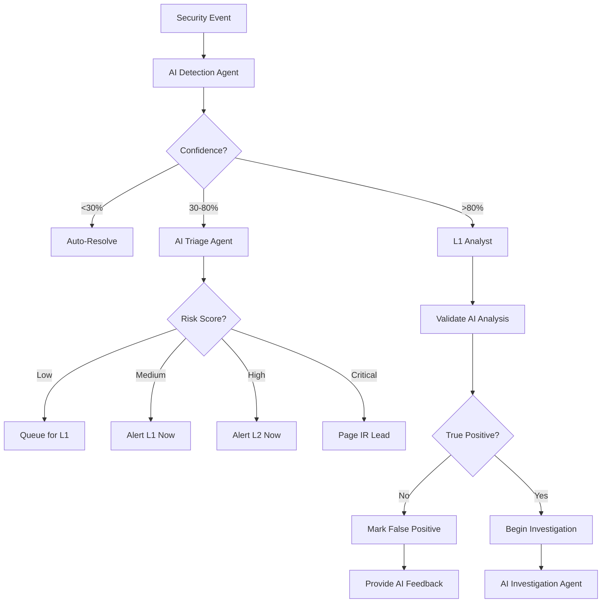
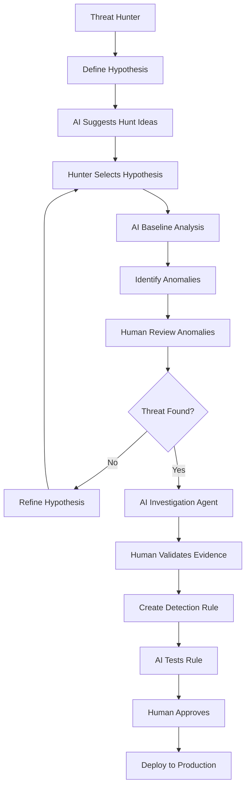
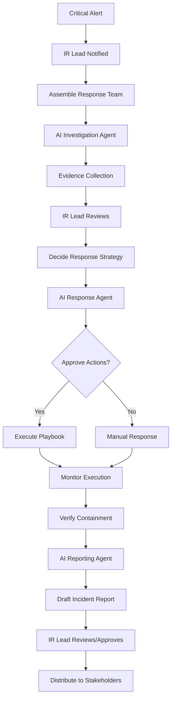

# AI-Augmented Workforce Model

**Document Version:** 1.0  
**Date:** December 1, 2025  
**Status:** Active  
**ISO/IEC 27001:2022 Alignment:** A.5.7, A.6.8, A.5.23, A.8.15, A.8.16

---

## Table of Contents

1. [Introduction](#1-introduction)
2. [Workforce Philosophy](#2-workforce-philosophy)
3. [Human Roles and Responsibilities](#3-human-roles-and-responsibilities)
4. [AI Agent Capabilities](#4-ai-agent-capabilities)
5. [Human-AI Collaboration Model](#5-human-ai-collaboration-model)
6. [Workflow Integration](#6-workflow-integration)
7. [Decision Authority Matrix](#7-decision-authority-matrix)
8. [AI Agent Lifecycle](#8-ai-agent-lifecycle)
9. [Training and Skill Development](#9-training-and-skill-development)
10. [Performance Optimization](#10-performance-optimization)
11. [Ethical Guidelines](#11-ethical-guidelines)
12. [Implementation Roadmap](#12-implementation-roadmap)

---

## 1. Introduction

### 1.1 Purpose

This document defines the AI-Augmented Workforce Model for Sloane Catalyst Hub's Security Operations Center (SOC). It establishes how human security analysts and AI agents collaborate to achieve superior threat detection, faster incident response, and continuous security improvement.

### 1.2 Scope

The model covers:
- **Human Roles:** SOC Analyst (Tier 1-3), Threat Hunter, Incident Responder, SOC Manager
- **AI Agents:** Detection Agent, Triage Agent, Investigation Agent, Response Agent, Reporting Agent
- **Workflows:** Alert triage, threat hunting, incident investigation, response orchestration, reporting
- **Integration:** Handoff protocols, escalation paths, quality assurance

### 1.3 Core Principles

1. **Human-in-the-Loop:** Humans make final decisions on critical actions
2. **AI as Force Multiplier:** AI handles repetitive tasks, analysts focus on complex problems
3. **Continuous Learning:** Both humans and AI improve through feedback loops
4. **Transparency:** AI reasoning is explainable and auditable
5. **Trust but Verify:** AI recommendations require human validation for high-impact actions

---

## 2. Workforce Philosophy

### 2.1 The Augmented Analyst

The traditional SOC analyst role evolves into the **Augmented Analyst**:

```
Traditional Analyst                    Augmented Analyst
├─ 80% Manual Triage                  ├─ 20% Manual Triage (AI filters)
├─ 15% Investigation                  ├─ 50% Investigation (AI assists)
├─ 3% Hunting                         ├─ 20% Hunting (AI suggests)
└─ 2% Improvement                     └─ 10% Improvement (AI measures)
```

**Key Shifts:**
- From **reactive** to **proactive** security posture
- From **alert fatigue** to **insight focus**
- From **manual correlation** to **guided investigation**
- From **tribal knowledge** to **documented intelligence**

### 2.2 Value Proposition

**For Analysts:**
- 60% reduction in alert fatigue (AI filters false positives)
- 3x faster investigation (AI provides context and evidence)
- Career growth through upskilling (focus on complex threats)
- Work-life balance (AI handles after-hours L1 triage)

**For Organization:**
- 70% faster Mean Time to Acknowledge (MTTA)
- 50% faster Mean Time to Respond (MTTR)
- 95%+ detection accuracy (human + AI validation)
- 24/7 coverage with smaller team (AI never sleeps)

**For Customers:**
- Proactive threat mitigation before impact
- Transparent security posture reporting
- Compliance-ready audit trails
- Continuous security improvement

---

## 3. Human Roles and Responsibilities

### 3.1 SOC Analyst - Tier 1 (L1)

**Primary Focus:** Alert validation, initial triage, basic response

**Responsibilities:**
1. **Alert Review (AI-Assisted)**
   - Review AI-triaged alerts (Critical/High priority)
   - Validate AI confidence scores and reasoning
   - Escalate ambiguous cases to Tier 2
   - Provide feedback on false positives/negatives

2. **Basic Response**
   - Execute approved response playbooks
   - Monitor automated containment actions
   - Document incident timelines
   - Communicate with affected users

3. **Quality Assurance**
   - Verify AI agent outputs for accuracy
   - Report AI performance issues
   - Suggest workflow improvements

**Daily Activities:**
- 08:00 - Review overnight AI alerts (20 alerts → 3 true positives)
- 09:00 - Investigate AI-flagged suspicious login patterns
- 10:00 - Validate AI response to brute force attack
- 11:00 - Team sync: Discuss AI false positive trends
- 13:00 - Execute playbook for phishing incident (AI-drafted)
- 15:00 - Training: New AI detection capabilities
- 16:00 - Update threat intelligence feeds
- 17:00 - Handoff to next shift with AI-generated summary

**Skills Required:**
- Basic security concepts (CIA triad, MITRE ATT&CK)
- SIEM query fundamentals
- Incident response procedures
- AI literacy (understanding confidence scores, reasoning)

**Success Metrics:**
- Alert validation accuracy > 98%
- MTTA < 5 minutes
- Escalation appropriateness > 95%
- AI feedback quality score > 4/5

### 3.2 SOC Analyst - Tier 2 (L2)

**Primary Focus:** Deep investigation, threat analysis, response coordination

**Responsibilities:**
1. **Complex Investigation (AI-Augmented)**
   - Investigate escalated incidents from L1/AI
   - Use AI investigation agent to gather evidence
   - Perform root cause analysis with AI assistance
   - Reconstruct attack timelines using AI correlation

2. **Threat Analysis**
   - Analyze emerging threat patterns identified by AI
   - Validate AI threat classification
   - Enrich threat intelligence with human context
   - Collaborate with AI to develop new detection rules

3. **Response Coordination**
   - Coordinate cross-functional incident response
   - Oversee AI-automated containment actions
   - Make judgment calls on complex response scenarios
   - Document lessons learned and update playbooks

**Daily Activities:**
- 08:00 - Review AI-detected advanced persistent threat (APT) indicators
- 09:30 - Deep dive investigation: Multi-stage attack chain (AI timeline)
- 11:00 - Collaborate with IT to contain compromised endpoint (AI playbook)
- 13:00 - Threat hunting session: AI suggests anomalous lateral movement
- 15:00 - Validate AI-proposed correlation rule for impossible travel
- 16:00 - Mentor L1 analyst on AI-assisted investigation techniques
- 17:00 - Update incident report with AI-drafted executive summary

**Skills Required:**
- Advanced threat detection and response
- Network and endpoint forensics
- Malware analysis fundamentals
- MITRE ATT&CK tactics and techniques
- AI agent orchestration and prompt engineering

**Success Metrics:**
- Investigation completion time < 2 hours (with AI)
- Root cause identification rate > 90%
- AI playbook adherence > 85%
- Incident report quality score > 4.5/5

### 3.3 SOC Analyst - Tier 3 (L3) / Threat Hunter

**Primary Focus:** Advanced threats, proactive hunting, AI model tuning

**Responsibilities:**
1. **Advanced Threat Hunting (AI-Powered)**
   - Lead proactive threat hunting campaigns
   - Use AI to identify weak signals and anomalies
   - Develop hypotheses and test with AI assistance
   - Discover zero-day threats before AI detection

2. **Detection Engineering**
   - Design and tune AI detection models
   - Create custom correlation rules
   - Validate AI-suggested detection improvements
   - Reduce false positive rates through AI refinement

3. **Strategic Intelligence**
   - Analyze adversary TTPs and trends
   - Provide strategic threat briefings to leadership
   - Collaborate with vendors on threat research
   - Shape organizational security strategy

**Daily Activities:**
- 08:00 - Review AI threat intelligence: New ransomware campaign
- 09:00 - Hunting session: Abnormal service account behavior (AI baseline)
- 11:00 - Tune AI anomaly detection model (reduce false positives 15% → 5%)
- 13:00 - Investigate AI-detected supply chain compromise indicators
- 15:00 - Present threat landscape briefing to CISO (AI-generated slides)
- 16:00 - Research emerging attack technique and train AI model
- 17:00 - Document hunting methodology for knowledge base

**Skills Required:**
- Expert-level threat hunting and forensics
- Data science and ML fundamentals
- Adversary emulation and red teaming
- Strategic thinking and communication
- AI/ML model evaluation and tuning

**Success Metrics:**
- Proactive threat discoveries per month > 2
- AI model accuracy improvement > 5% quarterly
- False positive reduction > 10% quarterly
- Hunting hypothesis success rate > 40%

### 3.4 Incident Response Lead

**Primary Focus:** Major incident coordination, crisis management

**Responsibilities:**
1. **Incident Command**
   - Lead response to critical security incidents
   - Coordinate cross-functional response teams
   - Make high-stakes decisions under pressure
   - Communicate with executives and stakeholders

2. **AI-Assisted Response**
   - Leverage AI for rapid evidence collection
   - Use AI playbooks as response framework
   - Override AI recommendations when necessary
   - Provide real-time feedback to improve AI response

3. **Post-Incident Analysis**
   - Conduct thorough post-mortem reviews
   - Identify root causes and contributing factors
   - Recommend security improvements
   - Update playbooks and AI training data

**Skills Required:**
- Crisis management and leadership
- Deep technical expertise across IT stack
- Business impact analysis
- Executive communication
- AI decision support systems

**Success Metrics:**
- Incident containment time < 15 minutes
- Business impact minimization score > 4/5
- Post-incident recommendations implemented > 80%
- Stakeholder satisfaction > 4.5/5

### 3.5 SOC Manager

**Primary Focus:** Team leadership, AI program governance, continuous improvement

**Responsibilities:**
1. **Team Development**
   - Hire and train augmented analysts
   - Develop AI literacy across team
   - Foster culture of human-AI collaboration
   - Measure team performance and satisfaction

2. **AI Governance**
   - Oversee AI agent performance and ethics
   - Approve AI model changes and deployments
   - Ensure AI transparency and auditability
   - Manage AI vendor relationships

3. **Strategic Planning**
   - Set SOC objectives and KPIs
   - Allocate resources (human + AI)
   - Report to leadership on security posture
   - Drive continuous improvement initiatives

**Skills Required:**
- Leadership and people management
- SOC operations and metrics
- AI/ML program management
- Budget and vendor management
- Strategic planning and communication

**Success Metrics:**
- Team engagement score > 4/5
- SOC operational efficiency improvement > 20% YoY
- AI agent uptime > 99.9%
- Security incident reduction > 15% YoY

---

## 4. AI Agent Capabilities

### 4.1 Detection Agent

**Purpose:** Continuously monitor security events and identify potential threats

**Capabilities:**
1. **Real-Time Analysis**
   - Process 100,000+ events per second across 6 detection domains
   - Apply ML models (Isolation Forest, Random Forest, LSTM)
   - Calculate risk scores and confidence levels
   - Flag anomalies and suspicious patterns

2. **Pattern Recognition**
   - Detect known attack signatures (MITRE ATT&CK)
   - Identify behavioral anomalies (3-sigma deviation)
   - Recognize multi-stage attack chains
   - Correlate events across time and domains

3. **Threat Classification**
   - Categorize threats by type (malware, phishing, DDoS, insider)
   - Assign severity (Critical, High, Medium, Low)
   - Map to MITRE ATT&CK tactics and techniques
   - Estimate confidence (0-100%)

**Limitations:**
- Cannot detect novel attacks without similar training data
- May produce false positives on legitimate but unusual behavior
- Requires human validation for high-confidence threats
- Cannot assess business context or impact

**Human Handoff:**
- **Trigger:** Confidence > 80% OR Severity = Critical
- **Deliverable:** Alert package with evidence, reasoning, risk score
- **Next Step:** L1 Analyst validates and investigates

### 4.2 Triage Agent

**Purpose:** Prioritize alerts and determine appropriate response path

**Capabilities:**
1. **Alert Prioritization**
   - Score alerts by risk (threat severity × asset value × confidence)
   - Deduplicate similar alerts into single incident
   - Enrich with threat intelligence context
   - Assign to appropriate analyst tier

2. **Initial Assessment**
   - Determine if alert is true positive, false positive, or benign
   - Identify affected users, systems, and data
   - Estimate business impact (high/medium/low)
   - Recommend initial response actions

3. **Routing Logic**
   - **Auto-Resolve:** False positives (confidence < 30%)
   - **L1 Analyst:** Low-medium risk, known threat patterns
   - **L2 Analyst:** High risk, complex multi-stage attacks
   - **L3/IR Lead:** Critical risk, APT, ransomware, data breach

**Limitations:**
- Cannot make judgment calls on ambiguous cases
- May underestimate risk for novel attack vectors
- Cannot assess political or reputational impact
- Requires human override for special circumstances

**Human Handoff:**
- **Trigger:** After initial triage and prioritization
- **Deliverable:** Prioritized incident queue with recommendations
- **Next Step:** Assigned analyst begins investigation

### 4.3 Investigation Agent

**Purpose:** Assist analysts in gathering evidence and reconstructing attack timelines

**Capabilities:**
1. **Evidence Collection**
   - Automatically query SIEM for related events
   - Pull logs from 6 detection domains (XDR)
   - Retrieve user activity and access history
   - Collect network traffic and endpoint telemetry

2. **Timeline Reconstruction**
   - Build chronological attack timeline
   - Identify attacker tactics, techniques, procedures (TTPs)
   - Map attack chain stages (reconnaissance → exploitation → exfiltration)
   - Visualize lateral movement and privilege escalation

3. **Context Enrichment**
   - Enrich IP addresses with geolocation and reputation
   - Lookup file hashes in threat intelligence feeds
   - Retrieve user risk profile and historical behavior
   - Correlate with external threat intelligence

**Limitations:**
- Cannot interpret human intent or motivation
- May miss context from informal communications
- Cannot perform physical forensics
- Requires human judgment for evidence weight

**Human Handoff:**
- **Trigger:** Evidence collection complete OR 30-minute timeout
- **Deliverable:** Investigation report with timeline, evidence, hypotheses
- **Next Step:** Analyst reviews findings and determines response

### 4.4 Response Agent

**Purpose:** Execute containment and remediation actions under human supervision

**Capabilities:**
1. **Automated Containment** (Pre-Approved Actions)
   - Lock compromised user accounts
   - Invalidate active sessions and tokens
   - Block malicious IP addresses at firewall
   - Quarantine suspicious files
   - Disable compromised API keys

2. **Playbook Execution**
   - Execute multi-step response playbooks (YAML)
   - Coordinate actions across multiple systems
   - Monitor execution status and handle failures
   - Log all actions for audit trail

3. **Notification and Escalation**
   - Notify affected users via email/SMS
   - Create tickets in ServiceNow/Jira
   - Alert on-call responders via PagerDuty
   - Send summary to Slack/Teams channels

**Limitations:**
- Cannot make high-impact decisions (e.g., isolate production server)
- Cannot assess business continuity risk
- Cannot communicate nuance to stakeholders
- Requires human approval for non-standard actions

**Human Handoff:**
- **Trigger:** High-impact action required OR playbook completion
- **Deliverable:** Response summary with actions taken, status
- **Next Step:** Analyst reviews response and approves next actions

### 4.5 Reporting Agent

**Purpose:** Generate incident reports and security metrics

**Capabilities:**
1. **Incident Report Generation**
   - Compile incident details (timeline, impact, response)
   - Draft executive summary with key findings
   - Generate technical appendix with evidence
   - Format for compliance requirements (ISO, SOC 2, etc.)

2. **Metrics and Analytics**
   - Calculate SOC performance metrics (MTTA, MTTR, accuracy)
   - Generate trend analysis and visualizations
   - Identify patterns in incident types and root causes
   - Produce monthly/quarterly security reports

3. **Knowledge Management**
   - Document lessons learned and recommendations
   - Update threat intelligence database
   - Maintain incident case history
   - Create training materials from real incidents

**Limitations:**
- Cannot provide strategic recommendations
- Cannot assess organizational risk appetite
- Cannot write with executive-level business context
- Requires human review and approval before distribution

**Human Handoff:**
- **Trigger:** Draft report complete
- **Deliverable:** Draft incident report or metrics dashboard
- **Next Step:** Analyst/Manager reviews, edits, and approves

---

## 5. Human-AI Collaboration Model

### 5.1 Collaboration Patterns

#### Pattern 1: AI-First Filtering

```
Security Event → AI Detection Agent → AI Triage Agent → Human Analyst
                                           ↓
                                    [Auto-Resolve 70%]
                                           ↓
                                    [Human Review 30%]
```

**When:** High-volume, low-complexity alerts (failed logins, port scans)
**Benefit:** Reduces analyst workload by 70%
**Risk:** May miss novel threats in auto-resolved alerts
**Mitigation:** Weekly audit of auto-resolved alerts by L2 analyst

#### Pattern 2: Human-AI Co-Investigation

```
Alert → Human Analyst (hypothesis) ⟷ AI Investigation Agent (evidence)
                                          ↓
                                    Human validates → Decision
```

**When:** Complex incidents requiring expert judgment
**Benefit:** 3x faster evidence collection, human retains decision authority
**Risk:** Over-reliance on AI evidence, missing context
**Mitigation:** Mandatory human validation of critical evidence

#### Pattern 3: AI-Suggested Human-Validated

```
AI Detection Agent → Suggests new correlation rule
                          ↓
                    L3 Analyst reviews → Tests → Approves
                          ↓
                    Deploy to production
```

**When:** AI identifies patterns humans missed
**Benefit:** Continuous improvement, proactive threat discovery
**Risk:** False positive increase if poorly validated
**Mitigation:** A/B testing, gradual rollout, rollback capability

#### Pattern 4: Human-Initiated AI-Executed

```
Analyst decides response → AI Response Agent executes playbook
                               ↓
                         Monitor execution
                               ↓
                         Analyst verifies outcome
```

**When:** Standard response actions (account lockout, IP block)
**Benefit:** 10x faster execution, zero human error
**Risk:** Incorrect action if decision was wrong
**Mitigation:** Dry-run mode, undo capability, audit log

### 5.2 Communication Protocols

#### AI-to-Human Communication

**Alert Format:**
```json
{
  "alert_id": "ALR-2025-001234",
  "timestamp": "2025-12-01T14:23:15Z",
  "severity": "High",
  "confidence": 0.87,
  "title": "Possible Account Takeover Detected",
  "summary": "User alice@example.com logged in from impossible travel location (NYC → Tokyo in 2 hours)",
  "reasoning": [
    "Failed login attempts from NYC (5x) at 14:00 UTC",
    "Successful login from Tokyo at 16:15 UTC",
    "Impossible travel distance: 10,850 km in 2.25 hours (requires 4,822 km/h)",
    "User's typical login locations: NYC, Boston (USA East Coast)"
  ],
  "evidence": {
    "failed_logins": 5,
    "login_ips": ["203.0.113.50", "198.51.100.25"],
    "distance_km": 10850,
    "time_hours": 2.25
  },
  "recommended_actions": [
    "Lock user account immediately",
    "Invalidate all active sessions",
    "Contact user via verified phone number",
    "Review recent account activity for data access"
  ],
  "mitre_attack": ["T1078 - Valid Accounts"],
  "requires_human": true,
  "escalate_to": "L1 Analyst"
}
```

**Key Principles:**
- **Explainability:** Always provide reasoning, not just conclusions
- **Confidence:** Express uncertainty with probability scores
- **Actionability:** Suggest concrete next steps
- **Traceability:** Include evidence IDs for drill-down

#### Human-to-AI Communication

**Feedback Format:**
```json
{
  "alert_id": "ALR-2025-001234",
  "analyst": "john.smith@sloanecat alysthub.com",
  "outcome": "True Positive",
  "accuracy": {
    "severity_correct": true,
    "confidence_appropriate": true,
    "reasoning_accurate": true,
    "evidence_sufficient": true
  },
  "response_taken": "Locked account, contacted user, verified legitimate travel",
  "lessons_learned": "User was traveling for business. Consider whitelisting known business travel patterns.",
  "ai_improvement": "Add business calendar integration to reduce false positives on planned travel.",
  "rating": 4.5
}
```

**Key Principles:**
- **Specificity:** Provide detailed feedback, not just "good/bad"
- **Learning:** Suggest improvements for AI models
- **Recognition:** Acknowledge accurate AI analysis
- **Correction:** Explain why AI was wrong (if applicable)

### 5.3 Escalation Paths

```
Level 0: AI Auto-Resolution (70% of alerts)
         └─ False positives, known benign patterns
         └─ No human review required
         └─ Weekly audit by L2 analyst

Level 1: L1 Analyst + AI Assistance (20% of alerts)
         └─ Low-medium risk, standard playbooks
         └─ AI provides context, analyst validates
         └─ Escalate if ambiguous or high-impact

Level 2: L2 Analyst + AI Investigation (8% of alerts)
         └─ High risk, complex multi-stage attacks
         └─ AI gathers evidence, analyst directs investigation
         └─ Escalate if APT or critical asset involved

Level 3: L3/IR Lead + AI Coordination (1.5% of alerts)
         └─ Critical risk, APT, ransomware, breach
         └─ AI coordinates response, human makes decisions
         └─ Notify CISO and stakeholders

Level 4: CISO + Executive Team (0.5% of alerts)
         └─ Catastrophic risk, regulatory reporting
         └─ Human leadership, AI provides intelligence
         └─ Crisis management, legal counsel
```

---

## 6. Workflow Integration

### 6.1 Alert Triage Workflow



**Workflow Steps:**

**Step 1: AI Detection (0-1 second)**
- AI Detection Agent processes security event
- Applies ML models and correlation rules
- Calculates confidence and risk score
- Decides: Auto-resolve, triage, or escalate

**Step 2: AI Triage (1-5 seconds)**
- AI Triage Agent enriches alert with context
- Deduplicates similar alerts
- Assigns priority score
- Routes to appropriate analyst tier

**Step 3: Human Validation (1-3 minutes)**
- L1 Analyst reviews AI-generated alert
- Validates AI reasoning and evidence
- Confirms true positive or marks false positive
- Provides feedback to improve AI

**Step 4: Investigation (varies)**
- Analyst uses AI Investigation Agent for evidence
- Reviews timeline and attack chain
- Determines root cause and impact
- Decides on response actions

**Step 5: Response (varies)**
- Analyst approves response playbook
- AI Response Agent executes actions
- Monitor execution and outcomes
- Document incident and lessons learned

### 6.2 Threat Hunting Workflow



**Workflow Steps:**

**Step 1: Hypothesis Generation (AI-Suggested)**
- AI analyzes threat intelligence and suggests hunt ideas
- Example: "Unusual service account logins after business hours"
- Hunter selects hypothesis based on risk and feasibility

**Step 2: Baseline Analysis (AI-Powered)**
- AI establishes normal behavior for hypothesis scope
- Example: Service accounts typically login M-F 6am-6pm EST
- Identifies deviations from baseline (3-sigma threshold)

**Step 3: Anomaly Investigation (Human-Led, AI-Assisted)**
- Hunter reviews AI-flagged anomalies
- AI provides context: user history, access patterns, risk score
- Hunter applies expertise to separate true threats from benign anomalies

**Step 4: Threat Validation (Human)**
- If threat found, hunter validates with AI investigation agent
- AI gathers forensic evidence across XDR domains
- Hunter confirms threat and assesses impact

**Step 5: Detection Engineering (Collaborative)**
- Hunter drafts new detection rule
- AI tests rule against historical data (precision/recall)
- Hunter approves and deploys to production
- AI monitors rule performance and suggests refinements

### 6.3 Incident Response Workflow



**Workflow Steps:**

**Step 1: Incident Activation (Human)**
- IR Lead notified of critical incident
- Assembles response team (L2/L3 analysts, IT, legal, etc.)
- Declares incident severity and activates war room

**Step 2: Rapid Evidence Collection (AI-Powered)**
- AI Investigation Agent gathers evidence across all systems
- Timeline reconstruction: What happened, when, by whom
- Scope assessment: Affected users, systems, data
- Impact estimation: Business, financial, reputational

**Step 3: Response Strategy (Human-Decided)**
- IR Lead reviews AI evidence and recommendations
- Decides containment strategy (isolate, lock, block, etc.)
- Considers business continuity and legal requirements
- Approves AI response playbook or directs manual response

**Step 4: Containment Execution (AI-Executed, Human-Monitored)**
- AI Response Agent executes approved playbook
- Real-time status updates to IR Lead
- Handles failures and retries automatically
- IR Lead monitors and can override at any time

**Step 5: Verification and Recovery (Human-Led)**
- IR Lead verifies threat is contained
- Coordinates with IT on system recovery
- Monitors for re-infection or persistence
- Declares incident contained/resolved

**Step 6: Post-Incident Report (AI-Drafted, Human-Approved)**
- AI Reporting Agent drafts comprehensive incident report
- Includes executive summary, timeline, impact, response, lessons learned
- IR Lead reviews, edits, and approves
- Distributed to stakeholders and filed for compliance

---

## 7. Decision Authority Matrix

### 7.1 Authority Levels

| Decision Type | AI Autonomous | AI Recommends, Human Approves | Human Decides, AI Assists | Human Exclusive |
|--------------|--------------|------------------------------|--------------------------|----------------|
| **Detection** | Known threats, high confidence (>95%) | Threats with moderate confidence (70-95%) | Novel threats, ambiguous signals | Strategic threat priorities |
| **Triage** | False positives (<30% confidence) | Standard alerts (30-80% confidence) | Complex multi-stage attacks | Crisis-level incidents |
| **Investigation** | Evidence collection, timeline building | Hypothesis generation, pattern analysis | Root cause analysis, impact assessment | Legal/regulatory implications |
| **Response** | Pre-approved playbooks (low risk) | Standard playbooks (medium risk) | Custom response (high risk) | Business-impacting decisions |
| **Reporting** | Metrics dashboards, routine reports | Draft incident reports | Executive summaries | Strategic recommendations |

### 7.2 High-Impact Actions (Human Approval Required)

**Infrastructure Actions:**
- Isolate production servers or critical infrastructure
- Disable multi-tenant services affecting multiple customers
- Restore from backup (potential data loss)
- Shut down business-critical applications

**User Actions:**
- Lock executive or service accounts (business disruption)
- Terminate high-privilege sessions (may disrupt operations)
- Mass password reset (user inconvenience)
- Revoke access to production systems

**Data Actions:**
- Delete or quarantine customer data
- Export sensitive data for forensic analysis
- Restore data from backup (potential loss)
- Grant access to external forensic teams

**Communication Actions:**
- Notify customers of security incident (reputational risk)
- File regulatory breach reports (legal implications)
- Engage law enforcement (investigation complexity)
- Issue public statements (PR management)

### 7.3 Override Authority

**When can humans override AI?**

**Always:**
- If AI recommendation conflicts with policy or legal requirements
- If business context suggests alternative response
- If AI reasoning is unclear or questionable
- If human intuition detects missed threat

**Override Process:**
1. Document reason for override in incident notes
2. Execute alternative action with justification
3. Provide feedback to AI team for model improvement
4. Review override in weekly SOC meeting

**When can AI override humans?**

**Never Autonomously.** AI can:
- **Suggest** alternative actions with reasoning
- **Warn** if human action may have unintended consequences
- **Request** human review if confidence is low
- **Escalate** if action violates policy or safety constraints

---

## 8. AI Agent Lifecycle

### 8.1 Deployment Pipeline

```
Development → Testing → Staging → Canary → Production
     ↓           ↓          ↓         ↓          ↓
  Sandbox    Synthetic   Test SOC  1% Traffic  100% Traffic
             Alerts                 Monitored   Monitored
```

**Phase 1: Development (Weeks 1-2)**
- AI engineers train models on historical data
- Test on known threat scenarios
- Measure precision/recall metrics
- Document model architecture and parameters

**Phase 2: Testing (Weeks 3-4)**
- Synthetic alert generation (simulated attacks)
- Red team evaluation (adversarial testing)
- Edge case validation (unusual but legitimate behavior)
- Performance benchmarking (latency, throughput)

**Phase 3: Staging (Week 5)**
- Deploy to test SOC environment
- Process real (anonymized) security events
- Compare AI output to human analyst decisions
- Collect feedback from SOC team

**Phase 4: Canary Release (Weeks 6-7)**
- Deploy to 1% of production traffic
- Run in parallel with existing system (shadow mode)
- Monitor for performance degradation or errors
- Gradually increase to 10%, 25%, 50% if successful

**Phase 5: Production (Week 8+)**
- Full deployment to 100% of traffic
- Continuous monitoring of accuracy and latency
- Weekly performance review with SOC team
- Quarterly model retraining with new data

### 8.2 Continuous Improvement

**Feedback Loop:**
```
AI Agent → Human Analyst → Feedback → AI Team → Model Update → AI Agent
```

**Feedback Types:**

**1. Correctness Feedback**
- True Positive: AI correctly identified threat
- False Positive: AI flagged benign activity as threat
- True Negative: AI correctly ignored benign activity
- False Negative: AI missed actual threat (discovered by human)

**2. Quality Feedback**
- Reasoning Clarity: Was AI explanation understandable?
- Evidence Sufficiency: Did AI provide enough context?
- Actionability: Were AI recommendations useful?
- Timeliness: Did AI respond fast enough?

**3. Improvement Suggestions**
- New detection rules to implement
- False positive patterns to filter
- Additional context to include
- UI/UX enhancements for analysts

**Monthly AI Review Meeting:**
- SOC team + AI engineers
- Review performance metrics (accuracy, latency, satisfaction)
- Discuss false positive/negative cases
- Prioritize improvements for next sprint
- Update AI training data and models

### 8.3 Model Governance

**Model Registry:**
- Centralized repository of all AI models
- Version control (model v1.0, v1.1, v2.0)
- Metadata: Training data, accuracy metrics, deployment date
- Rollback capability if model underperforms

**Model Monitoring:**
- **Accuracy:** Precision, recall, F1-score (target: >95%)
- **Latency:** Average response time (target: <1 second)
- **Drift Detection:** Model performance degradation over time
- **Bias Detection:** Disproportionate false positives by user group

**Model Retirement:**
- Deprecated when accuracy falls below threshold (<90%)
- Replaced with improved model version
- Historical data archived for audit and research
- Lessons learned documented

---

## 9. Training and Skill Development

### 9.1 AI Literacy Training (All SOC Analysts)

**Learning Objectives:**
- Understand ML fundamentals (supervised, unsupervised, neural networks)
- Interpret AI confidence scores and reasoning
- Recognize AI limitations and failure modes
- Provide effective feedback to improve AI

**Training Modules:**

**Module 1: AI Fundamentals (2 hours)**
- What is Machine Learning? Supervised vs Unsupervised
- How AI agents work: Training, inference, feedback loop
- Common ML models: Decision trees, neural networks, anomaly detection
- Hands-on: Explore AI agent reasoning for sample alert

**Module 2: Working with AI Agents (3 hours)**
- Detection Agent: How threats are identified
- Triage Agent: How alerts are prioritized
- Investigation Agent: How evidence is collected
- Response Agent: How playbooks are executed
- Hands-on: Investigate incident with AI assistance

**Module 3: AI Quality Assurance (2 hours)**
- Evaluating AI accuracy: True/false positives/negatives
- Recognizing AI biases and blind spots
- Providing actionable feedback
- Escalating AI errors appropriately
- Hands-on: Review AI-triaged alerts and provide feedback

**Module 4: Advanced AI Collaboration (3 hours)**
- Prompt engineering for investigation queries
- Tuning AI detection thresholds
- Designing custom response playbooks
- Collaborating with AI team on improvements
- Hands-on: Create custom correlation rule with AI assistance

**Certification:**
- 10-hour training course + exam (80% passing score)
- Recertification annually as AI evolves
- Continuing education: Quarterly AI update sessions

### 9.2 Analyst Upskilling Path

**Traditional SOC Career Path:**
```
L1 Analyst → L2 Analyst → L3/Threat Hunter → IR Lead → SOC Manager
(3-5 years)
```

**AI-Augmented SOC Career Path:**
```
L1 Augmented Analyst → L2 Augmented Analyst → L3 AI-Assisted Threat Hunter
                                                      ↓
                                              Detection Engineer
                                                      ↓
                                         AI Security Architect
```

**New Roles:**

**Detection Engineer:**
- Designs and tunes AI detection models
- Creates custom correlation rules
- Analyzes false positive/negative trends
- Collaborates with data science team

**AI Security Architect:**
- Designs AI agent architecture and workflows
- Evaluates AI/ML technologies and vendors
- Ensures AI security, privacy, and ethics
- Leads AI program strategy

**Upskilling Focus Areas:**
1. **Data Analysis:** SQL, Python, Jupyter notebooks
2. **ML Fundamentals:** Scikit-learn, model evaluation
3. **Prompt Engineering:** Effective AI communication
4. **Automation:** Playbook design, API integration
5. **Business Acumen:** Risk assessment, stakeholder communication

### 9.3 Training Resources

**Internal:**
- AI agent sandbox environment for hands-on practice
- Recorded incident investigations with AI
- Monthly "Lunch & Learn" sessions on AI topics
- Mentorship program: Pair L1 with experienced L3

**External:**
- SANS AI Security courses
- Coursera: Machine Learning for Security
- MITRE ATT&CK training
- Vendor certifications (Splunk, Microsoft Sentinel)

**Budget:**
- $2,000 per analyst per year for training
- 40 hours per analyst per year for training time
- Conference attendance (1 per analyst per year)

---

## 10. Performance Optimization

### 10.1 Key Performance Indicators (KPIs)

**Efficiency Metrics:**
- **MTTA (Mean Time to Acknowledge):** Target < 3 minutes (AI-assisted)
- **MTTR (Mean Time to Respond):** Target < 15 minutes (AI-assisted)
- **Alert Volume Reduction:** Target 70% through AI filtering
- **Investigation Time:** Target 50% reduction with AI assistance

**Accuracy Metrics:**
- **Detection Accuracy:** Target > 95% (AI + human validation)
- **False Positive Rate:** Target < 5% (AI filtering)
- **False Negative Rate:** Target < 2% (proactive hunting)
- **Triage Accuracy:** Target > 98% (AI + L1 validation)

**Human-AI Collaboration Metrics:**
- **AI Recommendation Acceptance Rate:** Target > 85%
- **Human Override Rate:** Target < 10%
- **Feedback Quality Score:** Target > 4/5
- **Analyst Satisfaction with AI:** Target > 4/5

**Business Impact Metrics:**
- **Proactive Threat Detection:** Target > 30% of incidents
- **Incident Escalation Rate:** Target < 5% to CISO
- **Security Posture Score:** Target > 85/100
- **Customer Impact Incidents:** Target < 2 per year

### 10.2 Continuous Improvement Process

**Weekly SOC Standup (30 minutes):**
- Review past week's incidents and AI performance
- Discuss false positives/negatives and root causes
- Share lessons learned and best practices
- Assign action items for AI improvements

**Monthly AI Performance Review (2 hours):**
- Deep dive on KPIs and trends
- Analyze AI agent accuracy and latency
- Review analyst feedback and satisfaction
- Prioritize improvements for next month

**Quarterly Strategic Review (Half day):**
- Executive summary of SOC and AI performance
- Benchmark against industry standards
- Strategic initiatives and roadmap
- Budget and resource planning

**Annual AI Audit (1 week):**
- Independent audit of AI models and workflows
- Bias detection and fairness assessment
- Compliance verification (ISO, SOC 2, GDPR)
- External red team assessment

### 10.3 Optimization Strategies

**For AI Agents:**
1. **Model Retraining:** Monthly with new threat data
2. **Hyperparameter Tuning:** Quarterly to optimize accuracy/speed
3. **Ensemble Models:** Combine multiple models for better accuracy
4. **Feature Engineering:** Add new data sources to improve detection

**For Human Analysts:**
1. **Workload Balancing:** Distribute cases based on skill and capacity
2. **Specialization:** Assign analysts to specific threat types (ransomware, insider, etc.)
3. **Automation:** Automate repetitive tasks (report generation, ticket creation)
4. **Collaboration Tools:** Slack, war rooms, shared investigation boards

**For Human-AI Interface:**
1. **UI/UX Improvements:** Streamline AI agent interaction
2. **Notification Tuning:** Reduce alert noise, increase signal
3. **Feedback Loops:** Make it easy to provide AI feedback
4. **Explainability:** Improve AI reasoning transparency

---

## 11. Ethical Guidelines

### 11.1 Core Principles

**1. Human Dignity and Rights**
- AI agents serve humans, not replace them
- Respect employee privacy and autonomy
- Ensure fair treatment regardless of AI recommendations
- Protect employees from AI-induced stress or burnout

**2. Transparency and Explainability**
- AI reasoning must be explainable to non-experts
- No "black box" decisions on critical actions
- Audit trails for all AI decisions and actions
- Open communication about AI capabilities and limitations

**3. Fairness and Non-Discrimination**
- AI models tested for bias across user demographics
- No discrimination based on race, gender, location, etc.
- Equal protection for all users and systems
- Regular bias audits and remediation

**4. Privacy and Data Protection**
- AI training data anonymized and minimized
- Compliance with GDPR, CCPA, and privacy laws
- User consent for AI analysis of personal data
- Secure storage and access controls for AI data

**5. Accountability and Governance**
- Humans remain accountable for AI decisions
- Clear escalation paths for AI errors or concerns
- Independent oversight of AI program
- Whistleblower protection for AI ethics concerns

### 11.2 AI Ethics Committee

**Composition:**
- SOC Manager (Chair)
- CISO or Security Director
- Legal Counsel
- HR Representative
- Independent Ethics Advisor (External)

**Responsibilities:**
- Review AI agent deployments and model changes
- Investigate AI ethics concerns and complaints
- Approve high-risk AI use cases
- Publish annual AI ethics report

**Meeting Schedule:**
- Quarterly reviews of AI program
- Ad-hoc meetings for urgent concerns
- Annual public report on AI ethics

### 11.3 Employee Protection

**Job Security Commitment:**
- No layoffs due to AI implementation (2-year guarantee)
- Retraining and upskilling for affected roles
- New roles created (Detection Engineer, AI Architect)
- Transparent communication about workforce changes

**Work-Life Balance:**
- AI handles after-hours L1 triage (reduce on-call burden)
- Flexible schedules for AI-augmented analysts
- Mental health support for high-stress incidents
- Mandatory vacation and disconnect time

**Career Development:**
- AI literacy training for all analysts
- Upskilling budget: $2,000/analyst/year
- Internal mobility to new AI-adjacent roles
- Mentorship and leadership development

---

## 12. Implementation Roadmap

### Phase 1: Foundation (Months 1-2)

**Objectives:**
- Establish AI-augmented workforce vision and strategy
- Hire or train AI specialists
- Deploy AI agent infrastructure
- Launch pilot program with volunteer analysts

**Activities:**
- Week 1-2: Document AI-augmented workforce model ✅
- Week 3-4: Recruit and onboard AI engineers
- Week 5-6: Deploy AI agent platform (Detection, Triage, Investigation)
- Week 7-8: Pilot with 3 volunteer L1/L2 analysts

**Success Criteria:**
- AI agent platform operational
- 3 analysts trained and actively using AI
- Initial feedback collected
- Executive buy-in secured

### Phase 2: Expansion (Months 3-4)

**Objectives:**
- Roll out AI agents to full SOC team
- Train all analysts on AI literacy
- Establish feedback loops and improvement process
- Measure initial performance gains

**Activities:**
- Week 9-10: AI literacy training for all analysts (10 hours each)
- Week 11-12: Deploy AI agents to 50% of SOC team
- Week 13-14: Deploy AI agents to 100% of SOC team
- Week 15-16: Measure baseline performance (MTTA, MTTR, accuracy)

**Success Criteria:**
- All analysts certified in AI literacy
- AI agents handling 70% of alert triage
- MTTA reduced by 50% (baseline: 8min → target: 4min)
- Analyst satisfaction > 3.5/5

### Phase 3: Optimization (Months 5-6)

**Objectives:**
- Optimize AI models based on feedback
- Reduce false positive rate
- Launch threat hunting with AI assistance
- Create advanced playbooks

**Activities:**
- Week 17-18: Analyze false positive/negative patterns, retrain models
- Week 19-20: Deploy Detection Engineer role, hire/train 1-2 specialists
- Week 21-22: Launch AI-assisted threat hunting program (L3 analysts)
- Week 23-24: Create 10+ response playbooks for common incidents

**Success Criteria:**
- False positive rate < 10% (baseline: 20%)
- Detection accuracy > 93%
- 2+ proactive threats discovered via hunting
- 10+ playbooks deployed

### Phase 4: Maturity (Months 7-12)

**Objectives:**
- Achieve target KPIs for AI-augmented SOC
- Expand to advanced AI capabilities (predictive, autonomous)
- Share learnings with industry
- Plan for next-generation AI

**Activities:**
- Month 7: Deploy Response Agent with automated containment
- Month 8: Deploy Reporting Agent for automated reports
- Month 9: Launch quarterly AI performance reviews
- Month 10: Conduct first AI ethics audit
- Month 11: Present at industry conference on AI SOC
- Month 12: Plan 2026 roadmap (predictive analytics, GenAI)

**Success Criteria:**
- MTTA < 3 minutes ✓
- MTTR < 15 minutes ✓
- Detection accuracy > 95% ✓
- Analyst satisfaction > 4/5 ✓
- 70% reduction in manual triage ✓

---

## Appendix A: Sample AI Agent Interactions

### Example 1: L1 Analyst + Detection Agent

**Scenario:** Suspicious login from new location

**AI Alert:**
```
🚨 High Priority Alert

User: alice@sloanecat alysthub.com
Event: Login from new location (São Paulo, Brazil)
Time: 2025-12-01 14:23:15 UTC
Confidence: 72%
Risk Score: 68/100

Reasoning:
✓ User's typical locations: New York, Boston (USA)
✓ New location: São Paulo, Brazil (9,100 km away)
✓ No impossible travel (last login NYC 3 days ago)
⚠ User never logged in from South America before
⚠ IP reputation: Unknown (not flagged malicious)
✓ MFA successfully completed

Recommended Action:
- Contact user to verify legitimate login
- If unverified, lock account and invalidate sessions
- Monitor for suspicious activity (data access, permission changes)

Evidence: [View 5 related events]
```

**L1 Analyst Action:**
1. Reviews AI reasoning - makes sense
2. Checks user profile - Alice is sales manager with international clients
3. Calls Alice's mobile (verified number) - she's on business trip to Brazil ✓
4. Marks alert as **False Positive** - legitimate business travel
5. Provides feedback: "Consider checking calendar for travel events"

**Outcome:**
- Alert resolved in 3 minutes (vs 15 minutes manual investigation)
- AI learns: Travel to South America by sales team is common
- Future alerts adjusted: Lower risk score for sales users traveling internationally

### Example 2: L2 Analyst + Investigation Agent

**Scenario:** Potential data exfiltration

**AI Investigation Report:**
```
Investigation ID: INV-2025-001234
Started: 2025-12-01 15:10:00 UTC
Duration: 47 seconds
Domain: Data Security

Summary:
User bob@sloanecatalysthub.com downloaded 15GB of customer data,
which is 12.5x their 30-day average (1.2GB).

Timeline:
15:00:00 - User queries customer table (5,000 rows returned)
15:02:15 - User exports query results to CSV (15MB)
15:03:30 - User downloads CSV file
[... repeated 999 more times ...]
15:09:45 - Total downloaded: 15GB (1,000 files)

Attack Chain:
1. Reconnaissance: Query customer table to understand schema
2. Collection: Export large dataset in multiple files
3. Exfiltration: Download files to endpoint (avoiding DLP size limits)

Risk Factors:
⚠ Volume 12.5x baseline (statistical anomaly, 3.8 sigma)
⚠ Timing: After business hours (7pm, typical work hours 9am-6pm)
⚠ User behavior: No previous bulk exports in 6-month history
✓ User role: Sales Manager (authorized to access customer data)
✓ No external transfers detected (files remain on endpoint)

Hypothesis:
Possible insider threat preparing for data exfiltration OR
Legitimate business need (end-of-quarter sales analysis)

Recommended Action:
- Contact user's manager to verify business need
- Check endpoint for external storage devices or cloud uploads
- If suspicious, lock account and quarantine files
- Interview user to understand intent
```

**L2 Analyst Action:**
1. Reviews AI timeline - clear pattern of bulk export
2. Contacts Bob's manager - Bob recently gave 2-week notice (resignation) 🚩
3. Checks Bob's endpoint - USB drive connected, 15GB copied to drive 🚩🚩
4. Escalates to IR Lead - potential pre-departure data theft
5. IR Lead authorizes: Lock account, invalidate sessions, retrieve USB drive

**Outcome:**
- Insider threat detected and contained in 12 minutes
- AI investigation saved hours of manual log analysis
- Customer data protected from exfiltration
- Case referred to legal team for appropriate action

### Example 3: L3 Analyst + AI Threat Hunting

**Scenario:** Proactive hunt for privilege escalation

**AI Hunt Suggestions:**
```
🎯 AI-Suggested Hunt: Unusual Privilege Escalation Patterns

Hypothesis:
Attackers may be exploiting misconfigured service accounts
to gain elevated privileges without detection.

Baseline Analysis (90-day window):
- Service accounts: 47 total
- Typical activity: Scheduled jobs, API calls
- Privilege changes: 2-3 per month (during onboarding/offboarding)

Anomalies Detected (Past 7 days):
⚠ service-account-db01 granted admin role on 2025-11-28
⚠ Granted by: alice@sloanecatalysthub.com (standard user, not IT admin)
⚠ Activity after grant: 287 database queries (vs typical 10/day)
⚠ Queries accessing: user_roles, api_keys, security_events tables

Risk Score: 74/100
Confidence: 68% (ambiguous - could be legitimate automation project)

Recommendation:
Investigate service-account-db01 activity and permission grant
```

**L3 Analyst Action:**
1. Reviews AI baseline - privilege grants by non-IT users are unusual
2. Interviews Alice - she created service account for new automation project
3. Checks IT change requests - no approval for this service account 🚩
4. Reviews service account queries - accessing security-sensitive tables 🚩
5. Hypothesis: Alice's account compromised, attacker created backdoor

**Investigation:**
- AI Investigation Agent traces Alice's recent activity
- Finds: Alice's account logged in from unknown IP 3 days ago
- Finds: Password changed, 2FA disabled shortly after suspicious login
- Confirms: Account takeover, attacker created privileged service account

**Response:**
- Lock Alice's account, invalidate all sessions
- Disable service-account-db01
- Rotate API keys accessed by compromised account
- Reset Alice's password with in-person verification

**Outcome:**
- Advanced persistent threat (APT) detected proactively (before damage)
- AI-suggested hunt led to discovery of multi-day compromise
- Threat contained in 2 hours (vs days/weeks if not found proactively)
- New detection rule created: Alert on service account privilege grants by non-IT users

---

## Appendix B: AI Agent API Specifications

### Detection Agent API

**Endpoint:** `POST /api/v1/detection/analyze`

**Request:**
```json
{
  "event": {
    "domain": "identity",
    "event_type": "login_success",
    "timestamp": "2025-12-01T14:23:15Z",
    "user_id": "550e8400-e29b-41d4-a716-446655440000",
    "source_ip": "203.0.113.50",
    "location": {"latitude": -23.5505, "longitude": -46.6333},
    "device": "Mozilla/5.0 (Windows NT 10.0; Win64; x64)",
    "mfa_completed": true
  },
  "context": {
    "user_baseline": {
      "typical_locations": ["New York", "Boston"],
      "typical_login_hours": "08:00-18:00 EST"
    }
  }
}
```

**Response:**
```json
{
  "detection_id": "DET-2025-001234",
  "is_threat": true,
  "confidence": 0.72,
  "risk_score": 68,
  "severity": "high",
  "threat_category": "Account Takeover",
  "mitre_techniques": ["T1078"],
  "reasoning": [
    "User's typical locations: New York, Boston (USA)",
    "New location: São Paulo, Brazil (9,100 km away)",
    "No impossible travel (last login NYC 3 days ago)",
    "User never logged in from South America before",
    "IP reputation: Unknown (not flagged malicious)",
    "MFA successfully completed"
  ],
  "evidence": {
    "distance_from_baseline": 9100,
    "location_history_count": 0,
    "mfa_status": "completed"
  },
  "recommended_actions": [
    "Contact user to verify legitimate login",
    "If unverified, lock account and invalidate sessions",
    "Monitor for suspicious activity"
  ],
  "requires_human_review": true,
  "escalate_to": "L1 Analyst"
}
```

### Triage Agent API

**Endpoint:** `POST /api/v1/triage/prioritize`

**Request:**
```json
{
  "detection_id": "DET-2025-001234",
  "alerts": [
    {"alert_id": "ALR-001", "confidence": 0.72, "severity": "high"},
    {"alert_id": "ALR-002", "confidence": 0.45, "severity": "medium"},
    {"alert_id": "ALR-003", "confidence": 0.91, "severity": "critical"}
  ]
}
```

**Response:**
```json
{
  "triage_id": "TRI-2025-001234",
  "prioritized_alerts": [
    {
      "alert_id": "ALR-003",
      "priority_score": 95,
      "assigned_to": "L2 Analyst",
      "sla_response_time_minutes": 15
    },
    {
      "alert_id": "ALR-001",
      "priority_score": 68,
      "assigned_to": "L1 Analyst",
      "sla_response_time_minutes": 30
    }
  ],
  "auto_resolved": [
    {
      "alert_id": "ALR-002",
      "reason": "Low confidence, known false positive pattern"
    }
  ]
}
```

---

## Appendix C: Glossary

**AI Agent:** Autonomous software that performs security tasks with minimal human intervention

**Augmented Analyst:** Security analyst enhanced by AI assistance, focusing on complex problems

**Confidence Score:** AI's certainty in its prediction (0-100% or 0.0-1.0)

**Detection Accuracy:** Percentage of true threats correctly identified by AI

**Escalation:** Routing alert to higher-tier analyst or IR Lead for advanced handling

**False Negative:** Actual threat that AI failed to detect (dangerous miss)

**False Positive:** Benign activity that AI incorrectly flagged as threat (alert fatigue)

**Human-in-the-Loop:** AI workflow requiring human validation before action

**MTTA:** Mean Time to Acknowledge - average time to review alert after generation

**MTTR:** Mean Time to Respond - average time to contain threat after detection

**Playbook:** Automated response workflow executed by AI or analyst

**Risk Score:** Quantitative assessment of threat severity and business impact (0-100)

**Triage:** Process of prioritizing alerts by risk and assigning to appropriate responder

**XDR:** Extended Detection and Response - unified security across multiple domains

---

**Document Control:**
- **Author:** Security Operations Team
- **Approved By:** CISO
- **Next Review:** March 1, 2026 (Quarterly)
- **Version History:**
  - v1.0 (2025-12-01): Initial release
